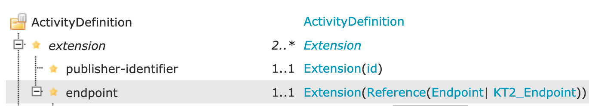

# Zelf Een ActivityDefinition Maken

Binnen Koppeltaal zijn er twee [extensies](https://simplifier.net/koppeltaalv2.0/kt2activitydefinition) toegevoegd aan de `ActivityDefinition`  resource:



Deze velden worden momenteel nóg niet afgedwongen op de Koppeltaal Server, maar zijn wel essentieel voor het goed functioneren van het systeem.

| Extensie | Beschrijving |
| :--- | :--- |
| publisher-identifier | Een unieke identifier voor de partij die de ActivityDefinition publiceert. Dit kan bijv. gebruikt worden om alle Tasks op te vragen die zijn gebaseerd op een ActivityDefinition van publisher _**x**_. |
| endpoint | Er kan per ActivityDefinition een referentie naar een Endpoint Resource meegegeven worden die aantoont waar de launch uitgevoerd moet worden. |

### Valide ActivityDefinition

```javascript
{
  "resourceType": "ActivityDefinition",
  "extension": [
    {
      "url": "http://example.org/fhir/StructureDefinition/KT2_EndpointExtension",
      "valueReference": {
        "reference": "Endpoint/209",
        "type": "Endpoint"
      }
    },{
      "url":"https://example.org/fhir/StructureDefinition/KT2_PublisherIdentifier",
      "valueString": "my-publisher-uuid"
    }
  ],
  "identifier": [
    {
      "use": "official"
    }
  ],
  "name": "My name",
  "title": "My title",
  "status": "active"
}
```

