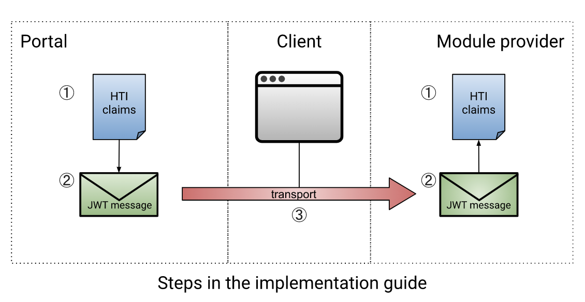

# HTI Flow

[HTI](https://github.com/GIDSOpenStandaarden/GIDS-HTI-Protocol/blob/master/HTI.md) is a light-weight solution from [GIDS](https://www.gidsopenstandaarden.org/hti-health-tools-interoperability) to quickly implement client-to-client launches. In short, the HTI launch is simply a [signed JWT](../connectie-maken-met-koppeltaal/requirements/jwt-ondertekenen.md) with HTI-specific claims that is sent from one client to another. A public key can be used to verify that the JWT comes from a trusted source.&#x20;

### Requirements

1. A [JWKS endpoint must be available](../connectie-maken-met-koppeltaal/requirements/jwks-opzetten.md).
2. The `module provider` uses [Token Introspection](launch-ontvangen/token-introspection.md) OR must be able to relate the issuer to its JWKS endpoint.

### Information Flow

The HTI launch can be done without an authentication server. Therefore, it is important that the `module provider` is in possession of the issuer and the related JWKS endpoint. This way it can be proven that the `portal` actually signed the JWT. A public key may also be exchanged, although there is a strong preference to use JWKS since applications must implement it to make a [Connection with Koppeltaal](../connectie-maken-met-koppeltaal/).

<figure><figcaption>
HTI Flow
</figcaption></figure>
