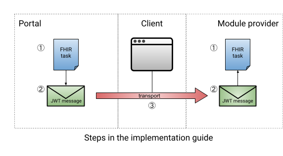

# HTI Flow

[HTI](https://github.com/GIDSOpenStandaarden/GIDS-HTI-Protocol/blob/master/HTI.md) is een light-weight oplossing van [GIDS](https://www.gidsopenstandaarden.org/hti-health-tools-interoperability) om snel client-to-client een launch te kunnen implementeren. Kort samengevat is de HTI launch simpelweg een [ondertekende JWT](../connectie-maken-met-koppeltaal/requirements/jwt-ondertekenen.md) met als payload een [FHIR Task](https://www.hl7.org/fhir/task.html) die verstuurd wordt van de ene client naar de andere. Middels een public key kan geverifieerd worden dan de JWT van een betrouwbare bron komt. De `Task` dient als context voor de launch.

### Requirements

1. Er moet een [JWKS endpoint opgezet](../connectie-maken-met-koppeltaal/requirements/jwks-opzetten.md) zijn.
2. De `module provider` moet in het bezit zijn van de issuer en de gerelateerde JWKS endpoint

### Informatie Flow

De HTI launch gebeurt zonder een authenticatie server. Daarom is het van belang dat de `module provider` in het bezit is van de issuer en de gerelateerde JWKS endpoint. Op deze manier kan bewezen worden dat het `portal` daadwerkelijk het bericht heeft samengesteld. Ook mag er een public key uitgewisseld worden, al is er  een sterke voorkeur om JWKS te gebruiken aangezien applicaties dit moeten implementeren om een [Connectie te maken met Koppeltaal](../connectie-maken-met-koppeltaal/).

