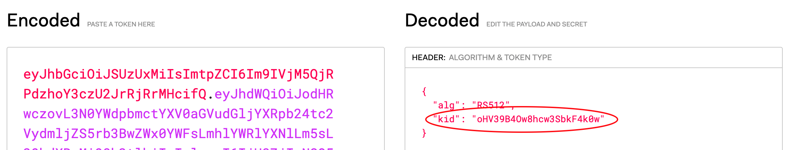

# HTI Launch Ontvangen

### Requirements

1. De applicatie moet een [`ActivityDefinition`](https://simplifier.net/koppeltaalv2.0/kt2activitydefinition) hebben [aangemaakt](../resources-managen/crud-operaties/resource-aanmaken.md).
2. De applicatie moet de `issuer` kennen en een JWKS endpoint hieraan gekoppeld hebben.

### JWT verifiëren

De applicatie kan aan de hand van de issuer en de JWKS endpoint valideren of de JWT daadwerkelijk  ondertekend is door de private key van het asymmetrische key pair. De JWK kan gevonden worden m.b.v. het `kid` \(key id\) veld uit de JWT Header sectie. Bijvoorbeeld:



Deze kan gemapt worden op JWK objecten uit het JWKS endpoint:

```javascript
{
  "keys": [
    {
      "kty": "RSA",
      "kid": "oHV39B4Ow8hcw3SbkF4k0w",
      "use": "sig",
      "n": "ngtOwJ9jxRyRL1HSlVVF-TI6iv2Pf3kWm2fereynTNz06tZaOo8hm6FA0fucLHH1OxsFFa6rDNyVZcivbR3uEO4CKXrzDw5HUDxLh9qaR-PMolsz4s2mrz6xP9kGkVvQvuzJPQTQ4fat6aI7p0cyA5xA8vqUBqeYU323zcf8uUXb-qSJ3FpidDnTKLksD7B-yjU1HjDdDysRp8pNL6lVs5KW2L8XMCpbrvhyIQ_c5pwOrF_QzfsK9mW78wCKLJZ_D7eVw2yututBzm9z0pq5PColQP2nB7lq98DNJvDbmvMIfDNglRKTS-Qqky_S8a6H5gfgFTv77iaaFFjjld4cJw",
      "e": "AQAB"
    }
  ]
}
```

De JWK geeft de public key weer die gebruikt kan worden om de signature te valideren.

### Andere Belangrijke Checks

Naast het verifiëren van de signature, bevat de JWT Payload velden die belangrijk zijn om te valideren. 

| JWT attribuut | Details | Implementatie |
| :--- | :--- | :--- |
| `exp` \(expiration time\) | Na dit tijdstip is de JWT niet meer valide | Wordt vaak automatisch gedaan door JWT-libraries |
| `iat`  \(issued at\) | Uitgifte datum, deze mag niet in de toekomst zijn | Wordt vaak automatisch gedaan door JWT-libraries |
| `jti` \(JWT ID\) | Unieke identifier voor deze JWT. De gebruikte `jti`  waarden moeten bijgehouden worden. Als een `jti` waarde al gebruikt is moet  de JWT afgekeurd worden. | Dient zelf geïmplementeerd te worden |

